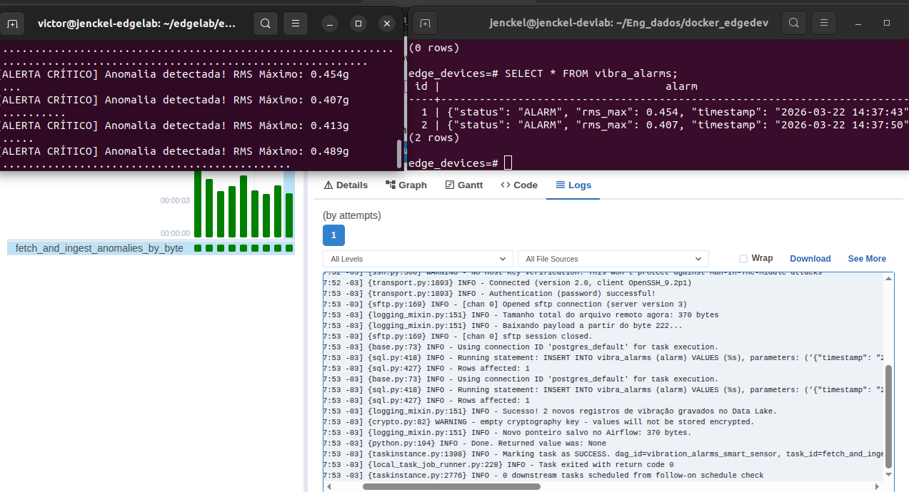
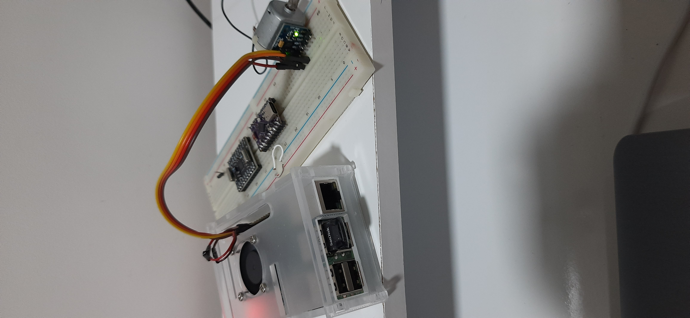
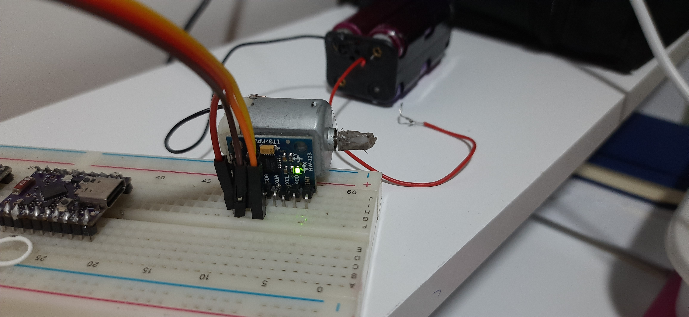
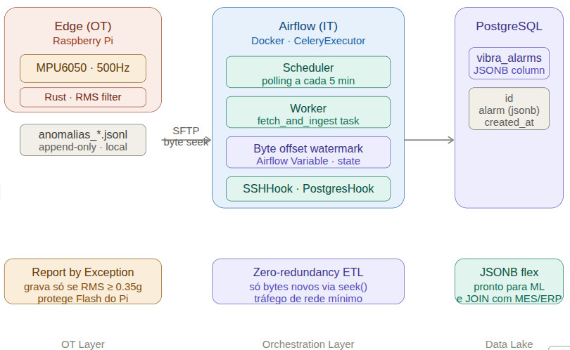

# 🏭 Edge-to-Lake: Monitoramento Preditivo de Vibração Industrial


Este projeto demonstra uma arquitetura completa de integração **OT/IT (Operation Technology / Information Technology)** para Manutenção Preditiva. O sistema captura dados brutos de vibração na borda (Edge), processa matematicamente os sinais em tempo real, e ingere apenas as anomalias em um Data Lake relacional usando orquestração inteligente de dados.

## 📸 Arquitetura em Ação









## 🎯 O Desafio de Negócio
Sensores de vibração geram uma quantidade massiva de dados em alta frequência. Enviar dados brutos continuamente de equipamentos industriais para servidores centrais satura a rede da fábrica e gera altos custos de armazenamento com dados inúteis (máquinas operando em estado normal). 

**A Solução:** Transferir a inteligência para a borda (Edge Computing) e orquestrar a extração de forma cirúrgica.

## 🧠 Destaques da Arquitetura

1. **Edge Analytics em Rust (Soft Real-Time):** Leitura via barramento I2C a 500Hz. O Rust foi escolhido pelo seu determinismo (sem Garbage Collector), garantindo que nenhum ciclo de máquina seja perdido. O algoritmo calcula o **RMS da vibração dinâmica**, isolando a gravidade estática.
2. **Report by Exception:** O Edge Gateway só escreve no disco local quando o RMS ultrapassa o limite de anomalia (0.35g), poupando a vida útil da memória Flash do equipamento.
3. **Extração Inteligente (Byte Offset Watermarking):** O pipeline de dados no Apache Airflow **não** faz o download do log inteiro. Ele utiliza ponteiros de estado (Variáveis) para consultar o tamanho do arquivo via SFTP e extrai **apenas os bytes novos** gerados desde a última execução, reduzindo o tráfego de rede a quase zero.
4. **Armazenamento Flexível (JSONB):** Ingestão bruta selada no PostgreSQL utilizando a tipagem `JSONB`, preparando o terreno para cruzamento de dados de produção (MES/ERP) e futuros modelos de Machine Learning sem engessar o schema.

## 🛠️ Stack Tecnológico

* **Hardware (OT):** Raspberry Pi (Linux Debian), Sensor Inercial MPU6050 (I2C), Motor DC com massa excêntrica (simulador de desbalanceamento).
* **Edge Software:** Rust, `rppal` (Raspberry Pi Peripheral Access Library).
* **Orquestração & ETL (IT):** Apache Airflow rodando em Docker, Python, `SSHHook` (Paramiko), `PostgresHook`.
* **Database:** PostgreSQL.

## ⚙️ Como o Pipeline Funciona

1. **Aquisição:** O Rust monitora o eixo Z do equipamento a 500 amostras por segundo.
2. **Detecção:** Ao detectar um pico anômalo, o log é formatado em `JSON Lines` e apendado no arquivo diário (ex: `anomalias_2026-03-22.jsonl`).
3. **Polling:** A cada 5 minutos, o Airflow abre um túnel SSH com o Edge Device.
4. **Seek & Read:** O Airflow compara o tamanho do arquivo remoto com o seu ponteiro interno. Se houve crescimento, ele executa um comando de *seek* e baixa apenas o delta (os dados novos).
5. **Ingestão:** Os payloads JSON são parseados e inseridos no PostgreSQL. O ponteiro é atualizado.

Desenvolvido por Victor Jenckel - Foco em integração OT/IT e Data Engineering Industrial.

## 📊 Extraindo Valor dos Dados

A arquitetura baseada em JSONB permite extrair os dados analíticos de forma relacional usando funções nativas do PostgreSQL. Exemplo de query para análise de severidade:

```sql
SELECT 
    id,
    alarm->>'timestamp' AS data_hora_falha,
    alarm->>'status' AS status_maquina,
    CAST(alarm->>'rms_max' AS FLOAT) AS pico_vibracao_g
FROM 
    vibra_alarms
WHERE 
    CAST(alarm->>'rms_max' AS FLOAT) > 2.0
ORDER BY 
    id DESC;


